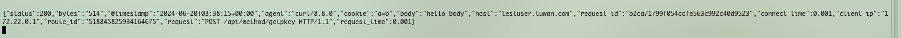
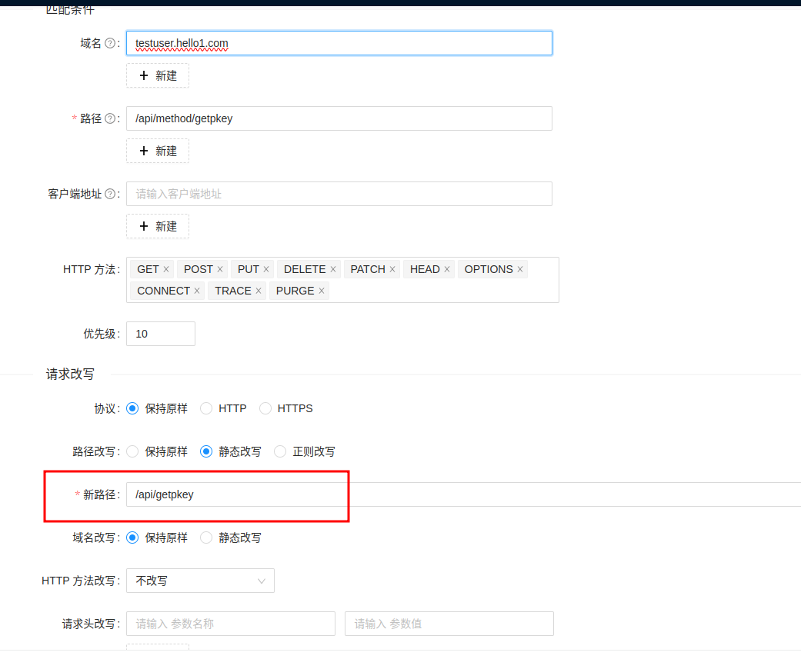

# 本地测试apifix
仅用于本地测试

# dashboard
http://192.168.2.248:9090

# 接入地址
```http://172.22.0.1:9080```

客户端请求地址: http://172.22.0.1:9080/api/action?a=1&b=2

# 简单使用
## 新增上游(后端服务)
### 服务ip端口配置

### 健康检查


## 新增路由
### 常规配置

### 实现转写

### 流量控制
#### 设置

#### 效果

### ip黑名单
#### 设置

#### 效果

### url禁止访问
#### 设置

#### 效果


# 插件
## 优先级
如果路由、服务、插件配置或消费者都绑定了相同的插件，则只有一份插件配置会生效，插件配置的优先级由高到低顺序是：消费者 > 路由 > 插件配置 > 服务。同时在插件执行过程中也会涉及 6 个阶段，分别是 rewrite、access、before_proxy、header_filter、body_filter 和 log。
服务的插件只有在路由无相同插件配置的时候才会生效。

## 插件
### file-logger
#### 设置
```json

{
  "_meta": {
    "disable": false
  },
  "include_req_body": true,
  "log_format": {
    "@timestamp": "$time_iso8601",
    "agent": "$http_user_agent",
    "body": "$request_body",
    "bytes": "$body_bytes_sent",
    "client_ip": "$remote_addr",
    "connect_time": "$upstream_connect_time",
    "cookie": "$http_cookie",
    "header": "$http_header",
    "host": "$host",
    "referer": "$http_referer",
    "remote_user": "$remote_user",
    "request": "$request",
    "request_id": "$request_id",
    "request_time": "$request_time",
    "status": "$status",
    "x_forwarded_for": "$http_x_forwarded_for"
  },
  "path": "logs/file.log"
}
```

#### 效果


# 组成模块
## 服务
### 服务本身
路由中的公共的插件配置,以及上游信息的集合

### 针对插件而言
本身可设置启用插件,以及在哪些上游中启用哪些插件

例如部分上游的公共配置:ip黑名单,禁止访问的url等,可在服务中统一设置,然后在`路由`中进行绑定

***注意*** 如果在路由中启用了同一个插件,服务中的插件配置会不起作用

### 使用场景
例: 有两个路由,分别是`testuser.hello.com/api/action1` `testuser.hello.com/api/action2`,这两都需要禁止ip,同时上游是一致的,此时就**不必**在这两个路由中都设置插件以及上游,直接**新增一个服务,在服务配置中新增ip-restriction插件配置,以及配置好上游,再回到路由中直接绑定服务**即可

## 通用插件配置
全局生效,适合配置公共的插件,避免在每个路由都重复设置

## 上游
### 说明 
后端服务实例集合

### 使用场景
例: 用户服务有两个实例,即可在一个上游配置中配置两个实例的节点,路由中可直接绑定这个上游配置

## 路由
### 说明
可以是一个对应一个url或者是多条url

### 使用场景
#### 场景1:
现在有两个域名`testuser.hello1.com` `testuser.hello2.com`,最终流量都打到同一个上游,这时候可以定义一个全面的路由: 将这两个域名的所有请求打到同一个上游
#### 场景2:对某一个url进行转写
需要将`testuser.hello1.com/api/method/getpkey`转写到上游的`/api/getpkey`

#### 场景3:对某个url或者一组url进行插件配置(ip黑名单等)