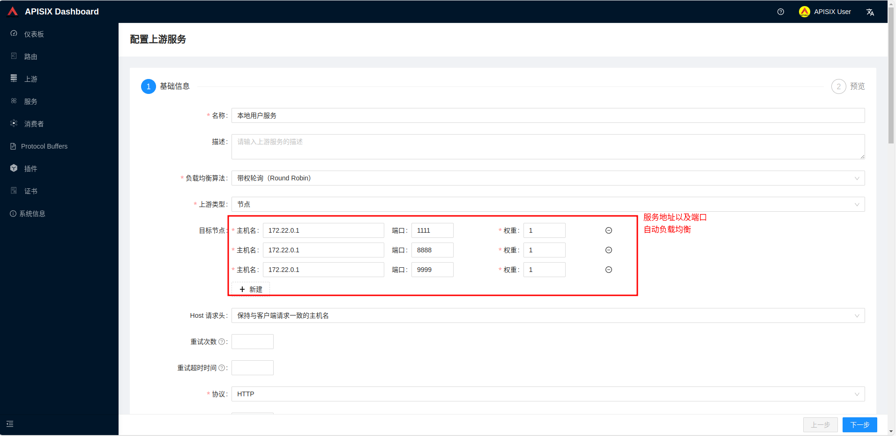
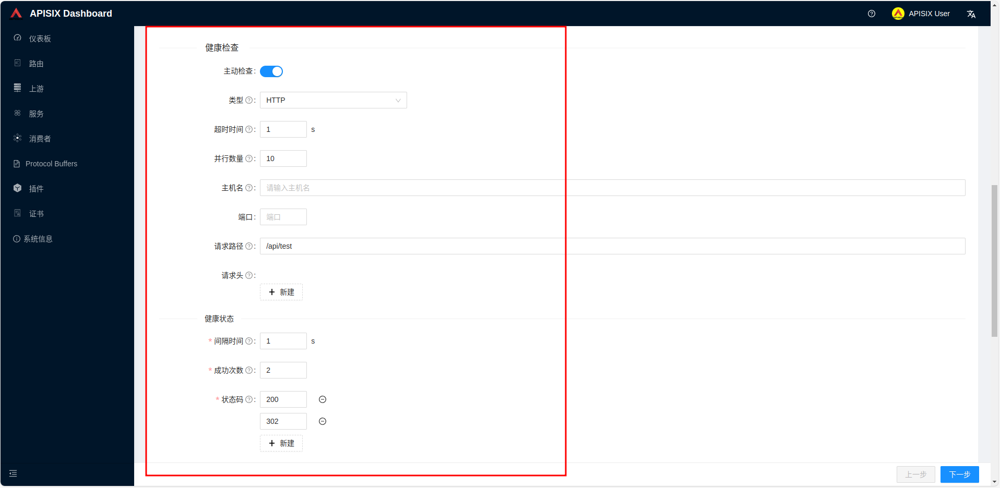
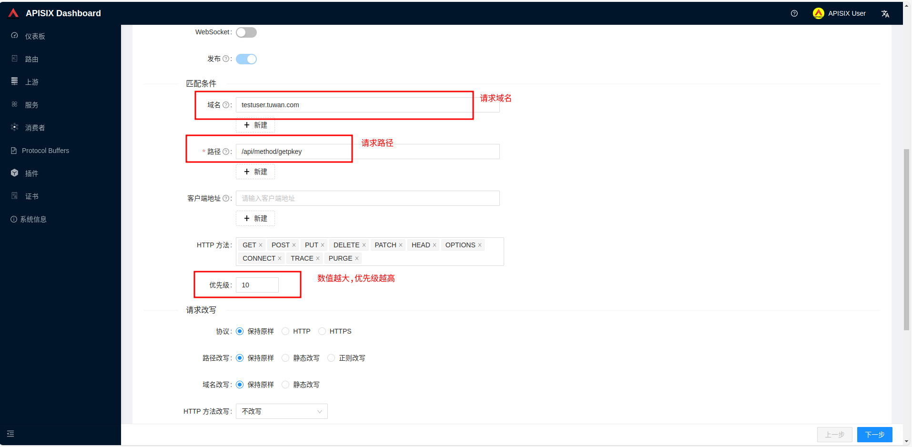
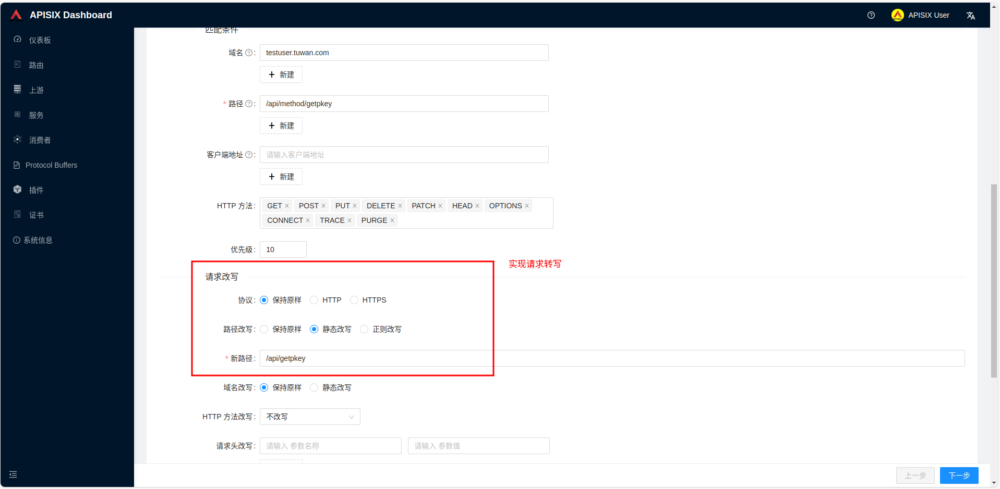
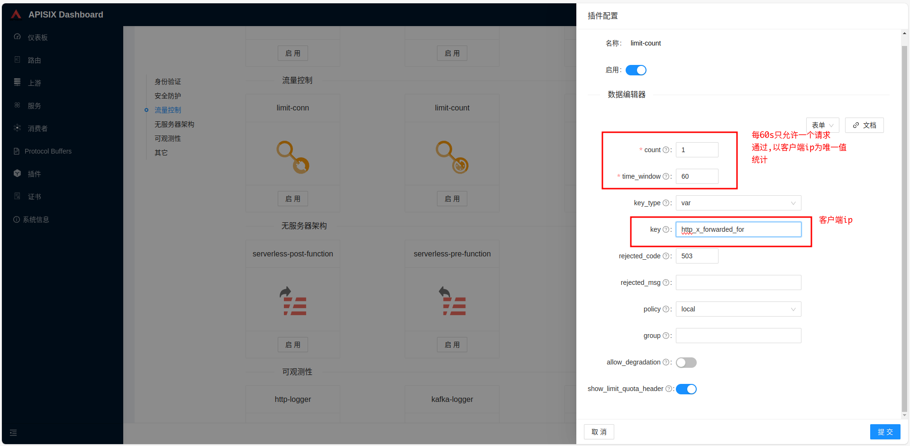
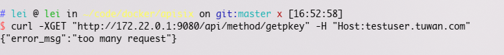
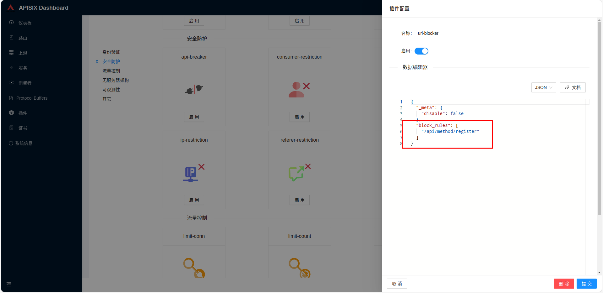

# 本地测试apifix
仅用于本地测试

# dashboard
http://localhost:9090

# 接入地址
```http://localhost:9080```

客户端请求地址: http://172.22.0.1:9080/api/action?a=1&b=2

# 简单使用
## 新增上游(后端服务)
### 服务ip端口配置

### 健康检查


## 新增路由
### 常规配置

### 实现转写

### 流量控制
#### 设置

#### 效果

### ip黑名单
#### 设置

#### 效果

### url禁止访问
#### 设置

#### 效果


# 插件
## 优先级
如果路由、服务、插件配置或消费者都绑定了相同的插件，则只有一份插件配置会生效，插件配置的优先级由高到低顺序是：消费者 > 路由 > 插件配置 > 服务。同时在插件执行过程中也会涉及 6 个阶段，分别是 rewrite、access、before_proxy、header_filter、body_filter 和 log。
服务的插件只有在路由无插件配置的时候才会生效。